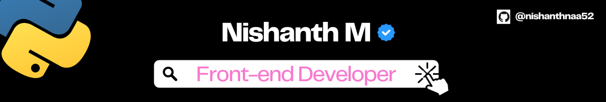

### I am Nishanth

Hello, I'm deeply interested in Python and web application development. Currently I am engineering collage student.

My focus is on honing my Python skills and delving into web development. I believe in continuous learning and am eager to apply my knowledge to real-world projects.

Open to networking and collaborations, I am keen on connecting with professionals in the field. Let's explore opportunities and share insights.

### Skills

   
    

### Contact me

    
